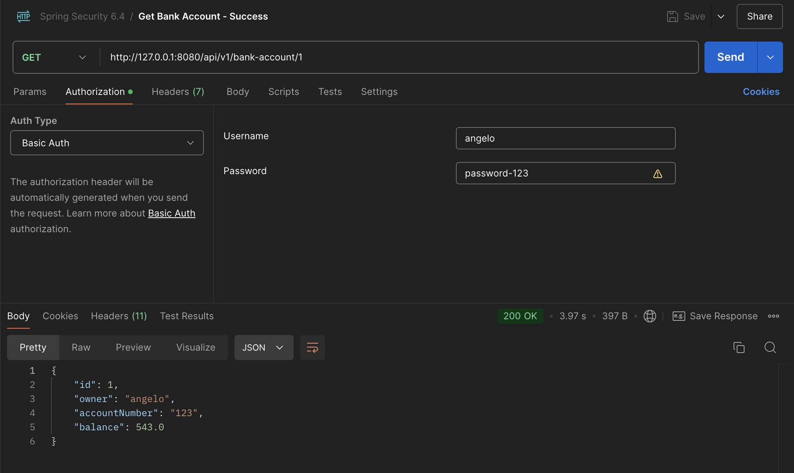
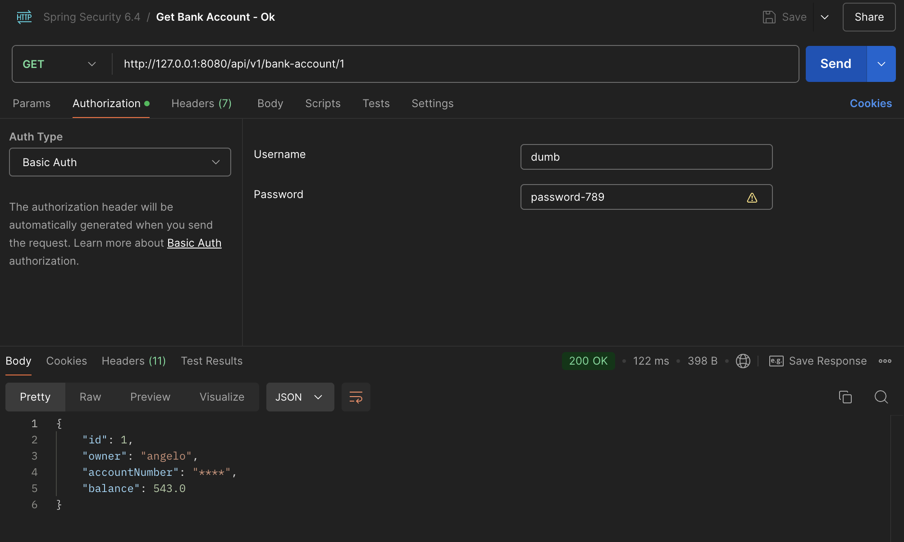
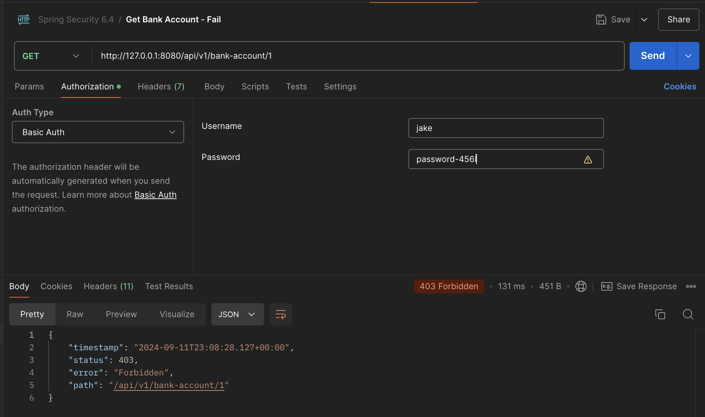

# Recursos de Autorização com Spring Security 6.4

## Recursos utilizados no projeto
- [Java 22](https://jdk.java.net/22/)
- [Spring Boot - 3.3.3](https://spring.io/projects/spring-boot)
- [IntelliJ IDEA 2023.3.6 (Community Edition)](https://www.jetbrains.com/idea/)


## Autenticação X Autorização
- Autenticação
    - Quem está tentando acessar um determinado recurso?
- Autorização
    - Dado que sei quem esta tentando acessar o recurso, ele tem permissão para isso ?
- Spring Security traz métodos de segurança que permite você separar sua logica de autorização da lógica de domínio.

## Criando a estrutura inicial
- O projeto irá se basear em uma aplicativo para banco.
- Criando a estrutura inicial do projeto com o [Spring Initializr](https://start.spring.io/)
- 
- A ideia desta aplicação é para que ela tenha uma estrura de domínio simples mas que foque em segurança.

## Criando a entidade de domínio Banck Account
- A classe será constituida com os seguintes atributos:
    - **id** - identificador da conta.
    - **owner** - identificador do proprietário da conta bancária.
    - **accountNumber** - número da conta bancária.
    - **balance** - saldo da conta.
    ```java
    @Data
    @Builder
    @AllArgsConstructor
    @NoArgsConstructor
    public class BankAccount {

        private Integer id;
        private String owner;
        private String accountNumber;
        private double balance;
    }
    ```

## Criando a classe de serviço BankAccountService
- A classe de serviço inicialmente irá receber dois métodos, `findById()` e `getById()`. Ambos irão executar a mesma ação mas a idéia aqui é pode utilizar o `getById()`, comparado com o `findById()`, para explicar melhor algumas das funcionalidades do Spring Security funciona de acordo com algumas circunstâncias.
- O objetivo aqui não é focar no tipo de dado que os métodos retornam, por isso suas informações de resposta serão um objeto com valor fixo.
    ```java
    public class BankAccountService {

        public BankAccountData findById(Integer id) {
            return BankAccountData.builder()
                    .id(id)
                    .accountNumber("1234")
                    .owner("angelo")
                    .balance(1000D)
                    .build();
        }

        public BankAccountData getById(Integer id) {
            return findById(id);
        }
    }
    ```

## Criando e validando nosso serviço com segurança
- Nesta etapa vou criar uma classe de teste unitário para poder ver como de fato a segurança esta sendo valiadade em alguns cenários.
- Aqui vou demonstrar em etapas e de modo bem manual o que acontece por de trás dos "*panos*". Vamos poder ver as regras sendo aplicadas para as validações de segurança e por fim como o Spring resume toda essa funcionalidade de uma maneira mais prática.

1. Método `login()`
    - O método configura um contexto de autenticação para simular o login de um usuário durante os testes.
    - O método recebe um parâmetro `user`, que representa o nome do usuário que está sendo autenticado.
    - Cria um token de autenticação que será usado para simular um usuário autenticado durante os testes.
        ```java
        Authentication auth = new TestingAuthenticationToken(user, "password", "ADMIN");
        ```
    - Na sequência vamos configurar o contexto de segurança e para isto vamos utilizar o seguinte trecho que vai definir o objeto de autenticação criado (`auth`) no contexto de segurança do Spring.
    - O `SecurityContextHolder` é uma classe que armazena o `SecurityContext`, permitindo que a autenticação esteja disponível em qualquer parte da aplicação que precise acessar informações sobre o usuário autenticado.
        ```java
        SecurityContextHolder.getContext().setAuthentication(auth);
        ```

2. Método `cleanUp()`
    - Método que será executado, limpando o `SecurityContextHolder` pré configurado, após a cada teste
        ```java
        @AfterEach
        void cleanUp() {
            SecurityContextHolder.clearContext();
        }
        ```
3. Cenários de testes
    - O primeiro teste deve encontrar uma conta bancária com sucesso
        ```java
        @Test
        @DisplayName("Should find the bank account with success")
        void findByIdGranted() {
            login("angelo");
            service.findById(1);
        }
        ```
    - O segundo teste deve encontrar uma conta bancária com sucesso
        ```java
        @Test
        @DisplayName("Should get the bank account with success")
        void getByIdGranted() {
            login("angelo");
            service.getById(1);
        }
        ```

    - O terceiro teste deve falhar ao tentar recuperar uma conta bancária da qual o usuário não tem acesso
        ```java
        @Test
        @DisplayName("Should fail to find the bank account")
        void findByIdWhenDenied() {
            login("jake");
            assertThatExceptionOfType(AuthorizationDeniedException.class)
                    .isThrownBy(() -> service.findById(1))
                    .withMessage("Access Denied");
        }
        ```

    - O quarto teste deve falhar ao tentar recuperar uma conta bancária da qual o usuário não tem acesso
        ```java
        @Test
        @DisplayName("Should fail to get the bank account")
        void getByIdWhenDenied() {
            login("jake");
            assertThatExceptionOfType(AuthorizationDeniedException.class)
                    .isThrownBy(() -> service.getById(1))
                    .withMessage("Access Denied");
        }
        ```

## Executando os testes
- *No projeto para este artigo esta sendo utilizado a versão 22 do Java e a versão 2023.3.6 (Community Edition) do IntelliJ, então em caso de falha ou se o seguinte erro acontecer ao executar os testes, segue a solução*
    - Falha:
        ```shell
        java: invalid source release 21 with --enable-preview
        (preview language features are only supported for release 22)
        ```
    - Solução:
        - **File > Project Structure > Modules > Language Level: X - Experimental features**
          
    - Fonte:
        - [Java 17: java: invalid source release 7 with --enable-preview (preview language features are only supported for release 17) - By Vy Do](https://stackoverflow.com/questions/70083274/java-17-java-invalid-source-release-7-with-enable-preview-preview-language)

- Inicialmente dos 4 testes que temos, 2 não devem passar pois ainda não temos implementado os requisitos de segurança para que o usuário logado não veja a conta da qual ele não deve ter acesso
  

## Ajustando nossa classe de serviço
- Voltando a classe `BankAccountService` vamos fazer um pequano ajuste no método `findById()`.
- Como `SecurityContextHolder` mantém os dados da autenticação atual, vamos recuperar estes dados e fazer nossa primeira validação por nome do usuário tentando acessar a conta bancária comparando com os dados do proprietário da conta bancária.
    ```java
    public BankAccountData findById(Integer id) {
        var bankAccount = BankAccountData.builder()
                .id(id)
                .accountNumber("1234")
                .owner("angelo")
                .balance(1000D)
                .build();

        // Getting the authenticated user from the session
        Principal principal = SecurityContextHolder.getContext().getAuthentication();

        // Checking if the authenticated user has the same name as the bank account owner
        if (!principal.getName().equals(bankAccount.getOwner())) {
            throw new AuthorizationDeniedException("Access Denied", new AuthorizationDecision(false));
        }

        return bankAccount;
    }
    ```
## De volta aos testes
- Com a alteração realizada no passo anterior agora devemos ter todos os testes passando.
  
- Mas como podemos melhorar o seguintes pontos?
    - 1. Para cada teste nós estamos limpando o usuário da sessão
    - 2. Estamos misturando nossa lógica de domínio com o serviço que válida o usuário da sessão.

## Hello World Spring Security!
- Para inicio vamos criar um objeto de proxy manualmente chamado `BanckAccountServiceProxy`. Com isso vou conseguir explicar melhor o que o Spring Security esta fazendo por trás.
- Esta nova classe vai extender `BankAccountService` e com isso vamos sobrescrever o método `findById()`.
- Na classe `BankAccountService` removemos a regra de validar o `owner` e passamos ela para `BanckAccountServiceProxy`.
- Com isso removemos a regra de validação de segurança do nosso domínio e passamos a utilziar um `proxy` para adminstrar isso.
    ```java
    public class BankAccountServiceProxy extends BankAccountService {

        @Override
        public BankAccountData findById(Integer id) {
            var bankAccount = super.findById(id);

            Principal principal = SecurityContextHolder.getContext().getAuthentication();

            if (!principal.getName().equals(bankAccount.getOwner())) {
                throw new AuthorizationDeniedException("Access Denied", new AuthorizationDecision(false));
            }

            return bankAccount;
        }
    }
    ```

- Vamos extrair os métodos `findById` e `getById` para uma interface chamada `BankAccountInterface`
    ```java
    public interface BankAccountInterface {
        BankAccountData findById(Integer id);
        BankAccountData getById(Integer id);
    }
    ```

- A classe final fica assim
    ```java
    @Service
    @AllArgsConstructor
    public class BankAccountServiceProxy implements BankAccountInterface {

        private final BankAccountService service;

        @Override
        public BankAccountData findById(Integer id) {
            var bankAccount = service.findById(id);

            Principal principal = SecurityContextHolder.getContext().getAuthentication();

            if (!principal.getName().equals(bankAccount.getOwner())) {
                throw new AuthorizationDeniedException("Access Denied", new AuthorizationDecision(false));
            }

            return bankAccount;
        }

        @Override
        public BankAccountData getById(Integer id) {
            return service.findById(id);
        }
    }
    ```

- E não se esqueça de alterar o seguinte trecho na classe de teste `BankAccountServiceTest` fazendo `service` receber agora uma instância da *interface* `BankAccountInterface`
    ```java
    public class BankAccountServiceTest {

        private final BankAccountInterface service = new BankAccountServiceProxy(new BankAccountService());
        //some code here...
    ```

- Agora apenas um testes vai falhar `@DisplayName("Should fail to get the bank account")` e isso se deve pois o caminho lógico sendo respeitado para ter o valor devolvido é:
    - 1. Temos uma instância da *interface* `BankAccountInterface`
    - 2. A *interface* irá chamar o método `service.getById(1)`
    - 3. A instância de `service` é de `new BankAccountServiceProxy` então o método `service.getById(1)` a ser executado será da classe `BankAccountServiceProxy`
    - 4. O método é
      ```java
      @Override
      public BankAccountData getById(Integer id) {
          return service.findById(id);
      }
      ```
    - 5. Este `findById()` vem do atributo importado na classe `private final BankAccountService service;`
    - 6. Por fim este método não chega a passar pela segurança e com isso retorna o valor fixo
      ```java
          @Override
          public BankAccountData findById(Integer id) {
              return BankAccountData.builder()
                      .id(id)
                      .accountNumber("1234")
                      .owner("angelo")
                      .balance(1000D)
                      .build();
          }
      ```
- Para corrgir este teste precisamos apenas implementar na classe `BankAccountServiceProxy` a validação de segurança em `getById()` igual temos em `findById()`
    ```java
    @Override
    public BankAccountData getById(Integer id) {
        var bankAccount = service.findById(id);
        Principal principal = SecurityContextHolder.getContext().getAuthentication();

        if (!principal.getName().equals(bankAccount.getOwner())) {
            throw new AuthorizationDeniedException("Access Denied", new AuthorizationDecision(false));
        }

        return bankAccount;
    }
    ```

## Utilizando recursos integrados do Spring Security
- Primeiramente vamos fazer algumas modificações nos nossos testes atendendo os pontos que haviam sido comentados:
    - 1. "*...Para cada teste nós estamos limpando o usuário da sessão*"
    - 2. "*...Estamos misturando nossa lógica de domínio com o serviço que válida o usuário da sessão.*"

- Na classe `BankAccountServiceTest` vamos remover
    - 1. O método `cleanUp()`
    - 2. O método `login()`
    - 3. Dentro dos testes remover a chamada do método `login()`

- Após a refatoração vamos adicionar `@SpringBootTest` no escopo da classe e também uma nova *annotation* chamada `@WithMockUser()`.
- Ela será utilizada em cada teste sendo passado o nome do usuário da sessão de teste
- *Ex.:* `@WithMockUser("angelo")`.
- A classe deve ficar assim com todos os testes passando.
    ```java
    @SpringBootTest
    public class BankAccountServiceTest {

        private final BankAccountInterface service = new BankAccountServiceProxy(new BankAccountService());
        
        @Test
        @DisplayName("Should find the bank account with success")
        @WithMockUser("angelo")
        void findByIdGranted() {
            service.findById(1);
        }

        @Test
        @DisplayName("Should get the bank account with success")
        @WithMockUser("angelo")
        void getByIdGranted() {
            service.getById(1);
        }

        @Test
        @DisplayName("Should fail to find the bank account")
        @WithMockUser("jake")
        void findByIdWhenDenied() {
            assertThatExceptionOfType(AuthorizationDeniedException.class)
                    .isThrownBy(() -> service.findById(1))
                    .withMessage("Access Denied");
        }

        @Test
        @DisplayName("Should fail to get the bank account")
        @WithMockUser("jake")
        void getByIdWhenDenied() {
            assertThatExceptionOfType(AuthorizationDeniedException.class)
                    .isThrownBy(() -> service.getById(1))
                    .withMessage("Access Denied");
        }
    }
    ```

- Mas como você pode notar estamos duplicando `@WithMockUser("angelo")` e `@WithMockUser("jake")` e isso não é bom pois temos tipos de pessoas diferentes e aqui estamos distinguindo isso apenas pelo nome.
- Vamos melhorar isso criando uma *annotation* específica para cada tipo de usuário.
- Vamos criar a *annotation* `WithMockUserAngelo` e `WithMockUserJake`
- Vamos criar uma terceira *Persona* que não tera um nome e sim uma *role*, ela tera o mesmo privilégio de acesso que um usuário adiministrador, sera `WithMockUserAdmin`

- `WithMockUserAngelo`
    ```java
    @Retention(RetentionPolicy.RUNTIME)
    @WithMockUser("angelo")
    public @interface WithMockUserAngelo {
    }
    ```

- `WithMockUserJake`
    ```java
    @Retention(RetentionPolicy.RUNTIME)
    @WithMockUser("jake")
    public @interface WithMockUserJake {
    }
    ```

- `WithMockUserAdmin`
    ```java
    @Retention(RetentionPolicy.RUNTIME)
    @WithMockUser(roles = {"ADMIN"})
    public @interface WithMockUserAdmin {
    }
    ```

- E com isso podemos incluir essas novas *annotations* em nossos testes, tudo deve continuar funcionando e os testes passando.
    ```java
        @Test
        @DisplayName("Should find the bank account with success")
        @WithMockUserAngelo
        void findByIdGranted() {
        //... some code here
    ```

## Utilizando lógicas de *pós* execução de método para aplicar autorização com Spring Security
- Voltando para nossa interface `BankAccountInterface` vamos fazer uma nova modificação.
- Quero utilizar o **Spring Security** para que faça uma *Pós* validação de segurança.
- No método `findById()` quero que após a sua execução seja validado se o retorno da informação, no caso o proprietário da conta, tenha o mesmo nome que o usuário logado na sessão.
- Para isso podemos utilizar uma *annotation* chamada `@PostAuthorize()` e informar para ela uma palavhra chave chamada `returnObject` aonde teremos acesso ao objeto retornado, no caso *BankAccount*.
- Tendo a informação de `BankAccount` e lembrando que o *Spring Security* tem acesso aos dados de quem está *logado* acessando `SecurityContextHolder`, podemos então criar uma simples validação.
- Verificamos então se após o objeto (*BankAccount*) retornado não sendo nulo e tiver a mesma informação (`returnObject?.owner`) que os dados sendo não nulos dentro de (*SecurityContextHolder*) tem (`authentication?.name`) então autorize o acesso ao objeto retornado.
- O serviço alterado fica assim
    ```java
    public interface BankAccountInterface {

        // returnObject? -> to avoid null pointer when access BankAccountData
        // .owner -> the BankAccountData owner
        // authentication? -> to avoid null pointer when access SecurityContextHolder
        // .name -- the name of the user in SecurityContextHolder
        @PostAuthorize("returnObject?.owner == authentication?.name")
        BankAccountData findById(Integer id);

        @PostAuthorize("returnObject?.owner == authentication?.name")
        BankAccountData getById(Integer id);
    }
    ```

- Ainda na classe `BankAccountInterface` vamos aproveitar e reutilizar uma unica *annotation* para que faça mesma função assim remover a duplicidade de regra.
- Criando uma nova *annotation* chamada `PosReadBankAccount`, nela iremos centralizar toda a lógica de verificação do nome do usuário e não só isso vamos adicionar também a lógica de verificação da *role* que o usuário autenticado na sessão tem
- A regra fica assim:
    - Após fazer a consulta verifico se o nome (`owner`)  é igual ao nome do usuário da sessão (`name`)
    - Se for verdadeiro
        - Retorna o objeto (dados da conta)
    - Se for falso 
        - Verifique se a *role* do usuário da sessão tem o nível de privilégio para acessar os dados do objeto retornado (os dados da conta)
            - Se for verdadeiro
                - Retorna o objeto (dados da conta)
            - Se for falso
                - Retornar falha *Access Denied*
    - Fim

- Ela deve receber as seguintes informações:
    ```java
    @Retention(RetentionPolicy.RUNTIME)
    @PostAuthorize("returnObject?.owner == authentication?.name or hasRole('ADMIN')")
    public @interface PosReadBankAccount {
    }
    ```

- Para mais informações sobre as palavras chave `returnObject`, `authentication` e `hasRole` acesse a documentação da classe [SecurityExpressionRoot](https://docs.spring.io/spring-security/site/docs/current/api/org/springframework/security/access/expression/SecurityExpressionRoot.html).

- Com a *annotation* criada, as alterações finais na interface deve ficar assim:
    ```java
    public interface BankAccountInterface {

        @PosReadBankAccount
        BankAccountData findById(Integer id);

        @PosReadBankAccount
        BankAccountData getById(Integer id);
    }
    ```

- Agora precisamos fazer uma simples alteração no nosso teste para entendermos melhor como o *Spring Security* funciona quando passamos a utiliza-lo.
- Na nossa classe de teste vamos alterar agora para que as configurações de um usuário criado seja feito por uma *factory* chamada `AuthorizationProxyFactory`
- Com isso quero que a minha classe `BankAccountServiceProxy` deixe de validar as regras de autorização que até então estão todas sendo feitas manualmente.
- A alteração na classe de teste fica assim:
    ```java
    AuthorizationProxyFactory factory
            = AuthorizationAdvisorProxyFactory.withDefaults();

    private final BankAccountInterface service = (BankAccountInterface) factory.proxy(new BankAccountService());
    ```
- Por fim lembra do nosso `WithMockUserAdmin` ? Pois bem, ele sera testado agora também! Quero que, se o nome do proprietário da conta não bater com o usuário logado verifique o tipo de acesso que ele tem, se for do tipo *ADMIN* então retorne o objeto
- Para isso vamos adicionar um novo teste que deve passar
    ```java
    @Test
    @DisplayName("Should find the bank account with success with role ADMIN")
    @WithMockUserAdmin
    void findByIdWithAdminGranted() {
        service.findById(1);
    }
    ```
- E para garantir que a regra de *role* está sendo executada criei um novo teste para um usuário que não tem nome e nem privilégio de *ADMIN*
- Criação do usuário
    ```java
    @Retention(RetentionPolicy.RUNTIME)
    @WithMockUser(roles = {"NOT_ADMIN"})
    public @interface WithMockUserNotAdmin {
    }
    ```
- Criação do teste
    ```java
    @Test
    @DisplayName("Should fail to find the bank account with not admin role")
    @WithMockUserNotAdmin
    void findByIdWhenDeniedWithNotAdminRole() {
        assertThatExceptionOfType(AuthorizationDeniedException.class)
                .isThrownBy(() -> service.findById(1))
                .withMessage("Access Denied");
    }
    ```

- Com essas novas alterações ja podemos remover a regra de validação que esta sendo feita na nossa classe de serviço `BankAccountServiceProxy`.
- A classe fica assim:
```java
@Service
@AllArgsConstructor
public class BankAccountServiceProxy implements BankAccountInterface {

    private final BankAccountService service;

    @Override
    public BankAccountData findById(Integer id) {
        return service.findById(id);
    }

    @Override
    public BankAccountData getById(Integer id) {
        return service.findById(id);
    }
}
```
- E todos os testes devem continuar passando.

## Inserindo regras de validação de segurança em nossas entidades de domínio
- Ja sabemos que um usuário com a *role* do tipo *ADMIN* consegue ter acesso a conta, mesmo não sendo o usuário logado na sessão, mas faria sentido ter acesso ao número da conta ?
- Para que possamos então retornar um valor *mascárado*, ou seja, ao invés do numero da conta, vamos utilizar uma regra do *Spring Security* para que possa ser retornado alguns asteriscos.
- Antes de tudo precisamos lembrar que `BankAccountData` não é uma classe que esta dentro das informações de *proxy* que acessamos por exemplo para pegar os dados do usuário da sessão, então como podemos resolver este problema ?
- Primeiramente vamos utilizar uma nova *annotation* chamada `@AuthorizeReturnObject` na nossa *annotation* criada chamada `PosReadBankAccount`
- Basicamente o que essa nova *annotation* faz é poder aplicar regras de acesso específicas baseadas no resultado que um método retorna, facilitando a implementação de lógica de segurança mais granular. Para mais informações acesso a documentação da *annotation* [@AuthorizeReturnObject](https://docs.spring.io/spring-security/reference/servlet/authorization/method-security.html#_using_authorizereturnobject_at_the_class_level)

- A partir deste ponto vamos fazer algumas alterações em nossa aplicação para que fique cada vez mais resumida, pois como ja passamos por diversos pontos aonde explico o que cada coisa faz, vou remover alguns trechos de código.
- Minha primeira alteração será na classe `BankAccountServiceProxy`, ela não será mais utilizada e também não ira implementar mais a nossa interface `BankAccountServiceProxy`. A cargo desta implementação e serviço deixo apenas a classe inicial `BankAccountService`
- Nossa classe `BankAccountServiceProxy` agora fica assim:
    ```java
    @Service
    @AllArgsConstructor
    public class BankAccountServiceProxy {

        @Autowired
        private final BankAccountService service;

        public BankAccountData findById(Integer id) {
            return service.findById(id);
        }

        public BankAccountData getById(Integer id) {
            return service.findById(id);
        }
    }
    ```
- E para que os testes continuem funcionando adiciono a *annotation* `@EnableMethodSecurity` na classe principal `Security64Application`
    ```java
    @SpringBootApplication
    @EnableMethodSecurity
    public class Security64Application {

        public static void main(String[] args) {
            SpringApplication.run(Security64Application.class, args);
        }

    }
    ```
- Mas e a máscara ? Para isso vamos criar uma classe do tipo *handler* para que possa interceptar qualquer falha que houver de segurança. 
- Se caso atender uma regra específica podemos tratar o retorno da maneira como quisermos.
- A classe criada se chama `MaskAuthorizationDeniedHandler` que deve implementar `MethodAuthorizationDeniedHandler`, e nela pedimos apenas para retornar uma sequência de astericos.
    ```java
    @Component
    public class MaskAuthorizationDeniedHandler implements MethodAuthorizationDeniedHandler {

        @Override
        public Object handleDeniedInvocation(MethodInvocation methodInvocation, AuthorizationResult authorizationResult) {
            return "****";
        }
    }
    ```
- E na nossa classe `BanckAccountData` vamos adicionar uma nova *annotation* que se caso houver uma falha (*nome do usuário da sessão não corresponder ao nome do proprietário da conta*) ao tentar recuperar o numero da conta (`getAccountNumber()`), vamos informar qual o tipo de tratamento que aquela *excpetion* deve ter.
- Para isso vamos adiconar a *annotation* `@HandleAuthorizationDenied` informando a ela qual será sua classe *handler* que deverá tratar a falha `(handlerClass = MaskAuthorizationDeniedHandler.class)`
- A classe `BankAccountData` fica assim:
    ```java
    @Builder
    @AllArgsConstructor
    @NoArgsConstructor
    @JsonSerialize(as = BankAccount.class)
    public class BankAccount extends SecurityData {

        private Integer id;
        private String owner;
        private String accountNumber;
        private double balance;

        @PreAuthorize("this.owner == authentication?.name")
        @HandleAuthorizationDenied(handlerClass = MaskAuthorizationDeniedHandler.class)
        public String getAccountNumber() {
            return accountNumber;
        }
    }
    ```
- E por fim vamos validar com os seguintes testes
- Deve ver o número da conta com sucesso
    ```java
    @Test
    @DisplayName("Should find the bank account with success see the account number")
    @WithMockUserAngelo
    void findByIdWithSuccessAndSeeTheAccountNumber() {
        var response = service.findById(1);
        assertEquals("1234", response.getAccountNumber());
    }
    ```

- Deve ver astericos no lugar do numero da conta
    ```java
    @Test
    @DisplayName("Should find the bank account with success but cannot see the account number")
    @WithMockUserAdmin
    void findByIdWithSuccessButCannotSeeTheAccountNumber() {
        var response = service.findById(1);
        assertEquals("****", response.getAccountNumber());
    }
    ```

- Por fim lembre-se que podemos ainda fazer qualquer tipo de validação dentro do nosso *handler* criado pois lá temos os dados de proxy, sendo assim podendo criar nossas próprias regras customizadas.

## Utilizando lógicas de *pré* execução de método para aplicar autorização com Spring Security
- Voltando para nossa interface `BankAccountInterface` vamos fazer mais uma modificação.
- Quero utilizar o **Spring Security** para que faça agora uma *Pré* validação de segurança.
- Vamos criar mais um método fictício que agora deve salvar uma nova conta bancária.
- Para isso vamos adicionar na nossa interface o seguinte método
    ```java
    void saveBankAccount(BankAccountData bankAccountDataToSave);
    ```
- Ainda no método `saveBankAccount()` quero que ele faça uma verificação do objeto que esta sendo persistido comparando o nome do proprietário da conta com o nome do usuário logado em sessão, e isso deve ocorrer antes dos dados serem "*persistidos*"
- Para isso vou adicionar então uma nova *annotation* chamada `@PreAuthorize()` e dentro dela passar a referência do objeto para recuperar o nome do proprietário da conta e comparar com o nome do usuário logado em sessão.
    ```java
    @PreAuthorize("#bankAccountDataToSave?.owner == authentication?.name")
    void saveBankAccount(BankAccountData bankAccountDataToSave)
    ```

- E para garantir que tudo continua funcionando vamos criar mais dois testes
    - 1. Um aonde um usuário que esta logado esta tentando salvar uma conta da qual ele tem acesso (a dele mesmo no caso).
        ```java
        @Test
        @DisplayName("Should save a bank account with success")
        @WithMockUserAngelo
        void shouldSaveABankAccountWithSuccess() {
            service.saveBankAccount(mockBankAccountAngelo());
        }
        ```
    - 2. E outro aonde o usuário logado não tem permissão para salvar a conta da qual não o pertence.
        ```java
        @Test
        @DisplayName("Should not save a bank account")
        @WithMockUserJake
        void shouldSNotSaveABankAccount() {
            assertThatExceptionOfType(AuthorizationDeniedException.class)
                    .isThrownBy(() -> service.saveBankAccount(mockBankAccountAngelo()))
                    .withMessage("Access Denied");
        }
        ```
- Agora vou adicionar mais um método que irá atualizar os dados bancários, a regra para autorização continua sendo a mesma
    ```java
    @PreAuthorize("#bankAccountDataToUpdate?.owner == authentication?.name")
    void updateBankAccount(BankAccountData bankAccountDataToUpdate);
    ```
- E adicionei também mais dois cenários de teste que segue a mesma lógica dos dois anteriores
    ```java
    @Test
    @DisplayName("Should update a bank account with success")
    @WithMockUserAngelo
    void shouldUpdateABankAccountWithSuccess() {
        service.updateBankAccount(mockBankAccountAngelo());
    }

    @Test
    @DisplayName("Should not update a bank account")
    @WithMockUserJake
    void shouldSNotUpdateABankAccount() {
        assertThatExceptionOfType(AuthorizationDeniedException.class)
                .isThrownBy(() -> service.updateBankAccount(mockBankAccountAngelo()))
                .withMessage("Access Denied");
    }
    ```
- Até aqui tudo certo, mas repare que na nossa interface estamos duplicando a *annotation* `@PreAuthorize` e alterando apenas o nome da referência do objeto que deve ser verificado. Como podemos então evitar essa duplicação ?
- Para isso vamos criar uma nova *annotation* e utilizar um recurso muito interessante do *Spring Security* chamado *templates*
- Básicamente iremos informar, ao usar a nova *annotation*, qual o nome da referência do objeto, e na regra da *annotation*, independente do nome que o objeto tem, ela sempre irá conseguir buscar o valor correto.
- Ao declararmos um atributo do tipo `String` com o nome `value` iremos conseguir utiliza-lo para ser a nossa referência do objeto que será passado tanto no método `saveBankAccount()` quanto no método `updateBankAccount()`
- A *annotation* que vamos criar irá se chamar `PreWriteBankAccount` e ela fica assim:
    ```java
    @Retention(RetentionPolicy.RUNTIME)
    @PreAuthorize("{value}?.owner == authentication?.name")
    public @interface PreWriteBankAccount {
        String value();
    }
    ```
- E na interface `BankAccountInterface` fazemos a seguinte alteração
    ```java
    @PreWriteBankAccount("#bankAccountDataToSave")
    void saveBankAccount(BankAccountData bankAccountDataToSave);

    @PreWriteBankAccount("#bankAccountDataToUpdate")
    void updateBankAccount(BankAccountData bankAccountDataToUpdate);
    ```

- Por fim, e se caso quisermos testar a aplicação fazendo chamadas *rest*, adicionei ao projeto um simples fluxo aonde utilizo toda a estrutura aqui documentada. O mais importante e apenas para etendermos como as coisas estão funcionando, crei um *bean* aonde insiro manualmente alguns usuários em sessão e com isso tento fazer algumas validações
- o *bena* se chama `SpringSecurity` e ele esta assim:
```java
@Configuration
public class SpringSecurity {

    @Bean
    PrePostTemplateDefaults prePostTemplateDefaults() {
        return new PrePostTemplateDefaults();
    }

    @Bean
    UserDetailsService userDetailsService() {
        UserDetails angelo = User.builder()
                .username("angelo")
                .password("{noop}password-123")
                .roles("MASTER")
                .build();

        UserDetails jake = User.builder()
                .username("jake")
                .password("{noop}password-456")
                .roles("TOP")
                .build();

        UserDetails dumb = User.builder()
                .username("dumb")
                .password("{noop}password-789")
                .roles("UP")
                .build();

        return new InMemoryUserDetailsManager(angelo, jake, dumb);
    }
}
```
- Para terstarmos como se fosse uma chamada *http* vou deixar de exemplo 3 cenários de teste, vale resssaltar que a classe / objeto que está sendo retornado como resposta precisa ter algumas configurações pois como ela se torna uma parte do proxy a biblioteca de desserialização `jackson` por si só não irá conseguir converter o dado para `json`
- O retorno sem desserialização
    

- Para que o retorno esteja correto precisamos da *annotation* `@JsonSerialize()` do pacote `com.fasterxml.jackson.databind.annotation.JsonSerialize` e do `@Data` do *Lombok*
- A classe fica assim:
    ```java
    @Data
    @Builder
    @AllArgsConstructor
    @NoArgsConstructor
    @JsonSerialize(as = BankAccount.class)
    public class BankAccount {
        //... some code here
    ```

- Agora subindo a aplicação e chamando a rota  `GET - /api/v1/bank-account/{id}` (aqui estou utilizando o [Postman](https://www.postman.com/downloads/))
- Vamos aos testes
    - 1. Sucesso ao estar logado com o usuário proprietário da conta
        
    - 2. Sucesso ao estar com um usuário que tem privilégio de ver alguns dados da conta mas não seu número
        
    - 3. Falha ao estar logado com um usuário que não deve ter acesso a conta da qual não é sua
        

## Enfim
- Por hoje é só, com isso conseguimos passar por algumas *features* que o *Spring Security* tem a nos oferecer.
- Para o projeto de teste veja o pacote `zzz` nele tem todas as classes utilziadas na explicação e todo o código utilizado, os comentários foram deixados propositalmente para que você consiga acompanhar a evolução do código entendendo cada etapa.
- Para a parte *rest* é só seguir os demais pacotes, simulei uma pequena aplicação separada por camadas e respeitando suas funcionalidades.
- como principal referência para este projeto, foi utilizado a apresentação 
    - [Let’s Explore Spring Security 6.4 (SpringOne 2024)](https://youtu.be/9eoi1TViceM)